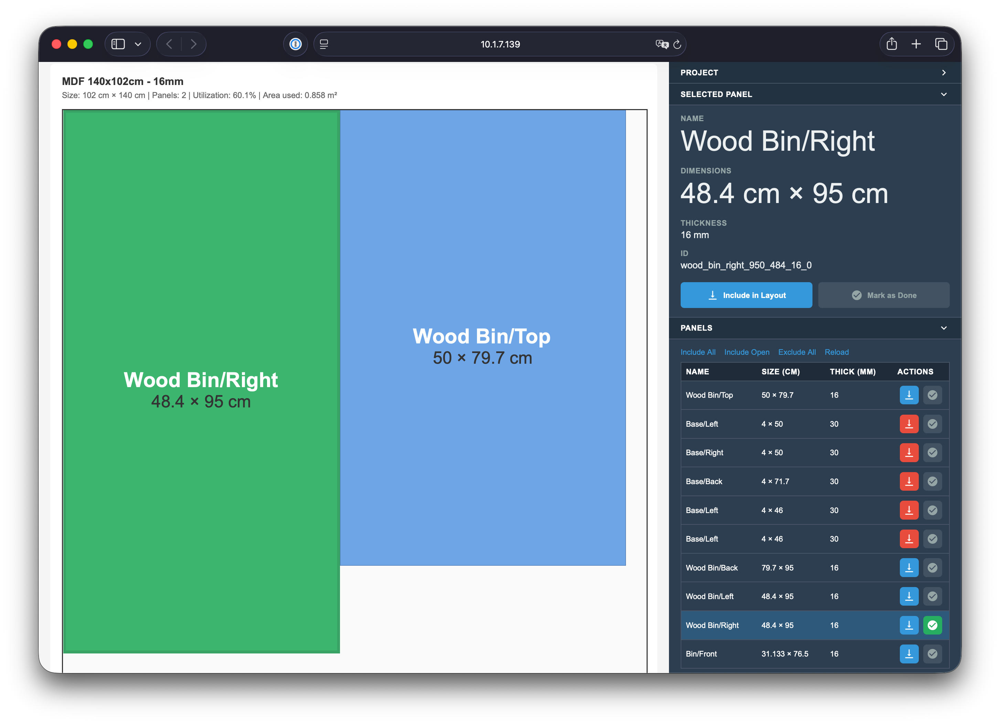

# cutplanner

A web-based tool for generating cutting layouts for sheet material. It reads panel data from an OpenSCAD file or a BOM YAML file and an inventory of available sheets, then provides an interactive cutting layout in the browser.

> [!NOTE]
> This tool was built with AI assistance for **personal use**. It does what it needs to do, but is not meant to be production-grade quality (whatever this may mean).



## Requirements

- Python 3.13+
- [OpenSCAD](https://openscad.org/) installed and available in `PATH` (only required when using `.scad` files as input)

## Installation

**Run directly** without installation using [uvx](https://docs.astral.sh/uv/):

```sh
uvx --from git+https://github.com/uberbruns/cutplanner cutplanner serve design.scad inventory.yaml
```

**After cloning:**

```sh
git clone https://github.com/uberbruns/cutplanner
cd cutplanner
uv sync
uv run cutplanner serve design.scad inventory.yaml
```

**Install globally via [mise](https://mise.jdx.dev/):**

```sh
mise use -g pipx:uberbruns/cutplanner
```

## Commands

### `cutplanner serve` — start the web server

```
cutplanner serve <input_file> <inventory_file> [options]

Arguments:
  input_file      Path to an OpenSCAD file (.scad) or a BOM YAML file (.yaml)
  inventory_file  Path to the inventory YAML file

Options:
  --kerf MM       Saw blade width in mm (default: 0)
  --port PORT     Port to listen on (default: 16080)
  --debug         Enable Flask debug mode
```

```sh
cutplanner serve design.scad inventory.yaml
cutplanner serve design.scad inventory.yaml --kerf 3
cutplanner serve bom.yaml inventory.yaml
```

Open `http://localhost:16080` in your browser. Individual panels can be marked as done; done state is persisted in the browser's `localStorage`.

### `cutplanner write-bom` — export BOM to YAML

Renders an OpenSCAD file and writes the panel list to a YAML file that can be used as input to `serve`.

```
cutplanner write-bom <scad_file> <output_file>
```

```sh
cutplanner write-bom design.scad bom.yaml
```

## Panel input formats

cutplanner accepts panel data in two formats.

### BOM YAML (`.yaml`)

A plain YAML file listing panels. Typically generated by `cutplanner write-bom` from an OpenSCAD file, but can also be written by hand.

```yaml
panels:
  - name: Side Panel
    length: 954
    width: 312
    thickness: 16
  - name: Bottom
    length: 800
    width: 400
    thickness: 16
```

| Field       | Type    | Required | Description                                      |
|-------------|---------|----------|--------------------------------------------------|
| `name`      | string  | yes      | Panel identifier                                 |
| `length`    | number  | yes      | Length in mm                                     |
| `width`     | number  | yes      | Width in mm                                      |
| `thickness` | number  | yes      | Thickness in mm                                  |

### OpenSCAD (`.scad`)

cutplanner renders the file via OpenSCAD and parses panel data from `echo()` statements in the output. Because OpenSCAD requires escaping in string literals, the typical pattern looks like this:

```openscad
echo(str("{\"name\":\"", name, "\",\"length\":", length, ",\"width\":", width, ",\"thickness\":", thickness, "}"));
```

Which produces a line in the OpenSCAD console like:

```
ECHO: "{"name":"Aside/Front","material":"Default","depth":7,"length":954,"width":312,"thickness":16}"
```

The same fields as the BOM YAML format apply. Any other fields in the object are ignored.

[uberbruns/headspace](https://github.com/uberbruns/headspace) is an OpenSCAD library that emits panel data in this format.

## Inventory format

The inventory YAML file lists the available sheets of material. The packer assigns panels to the smallest sheet that fits, working through the list until all panels are placed.

```yaml
inventory:
  - type: MDF
    dimensions:
      length: 2800
      width: 2070
      thickness: 16
  - type: Plywood
    dimensions:
      length: 1200
      width: 600
      thickness: 18
```

See [`examples/inventory.yaml`](examples/inventory.yaml) for a complete example.
